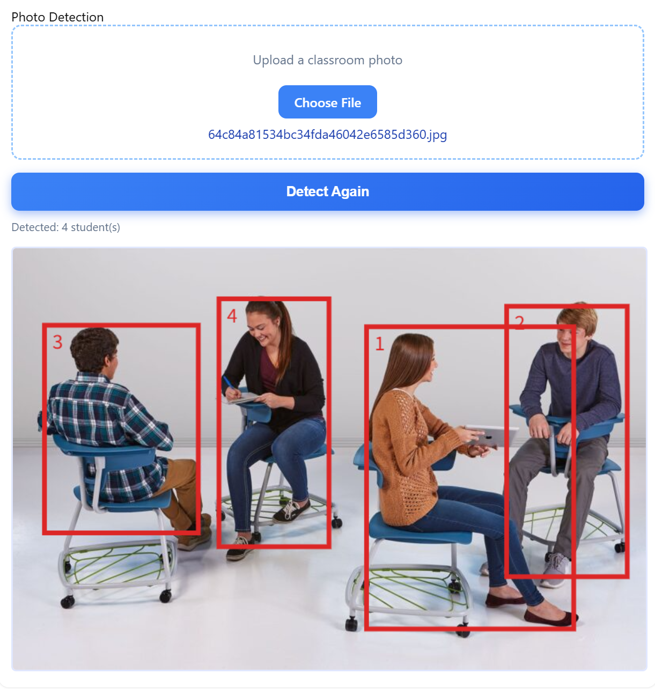
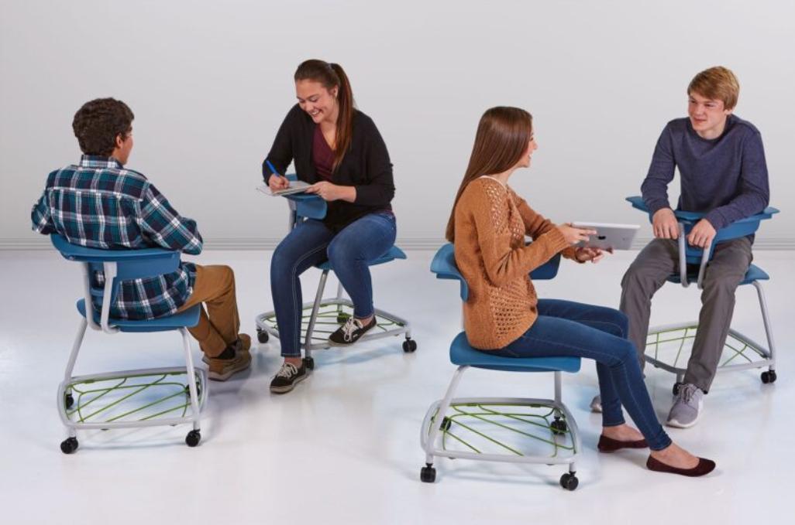
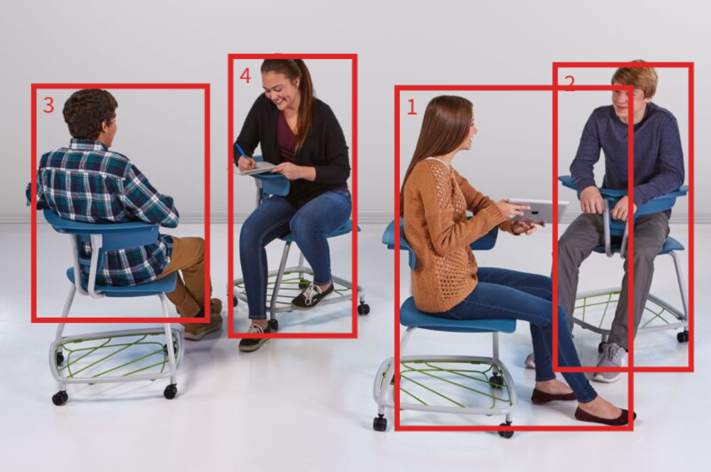
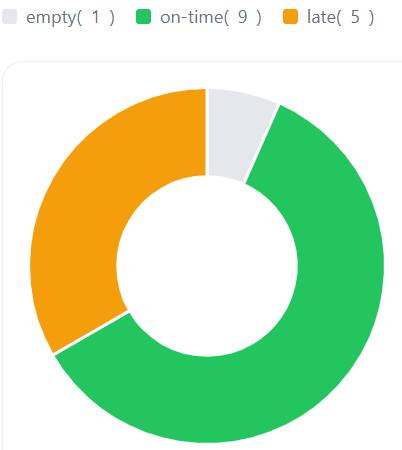
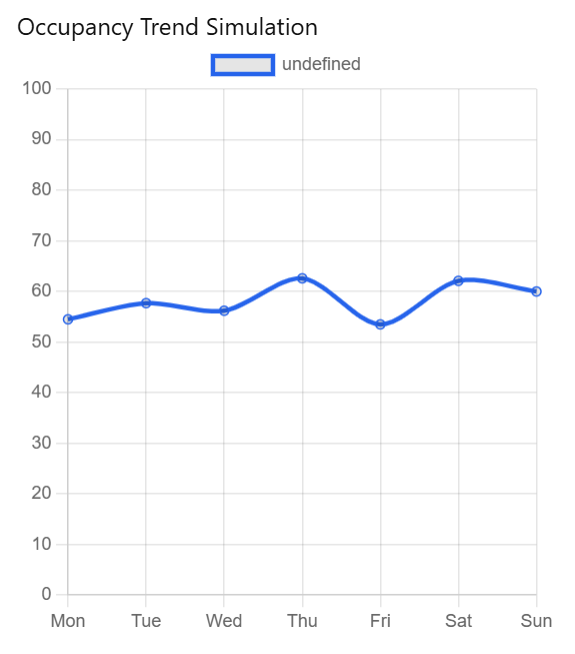

# Classroom Student Detector

A fast, accurate, and easy-to-deploy web tool that automatically detects and counts students in classroom photos using computer vision.

Upload any classroom image → instantly get red bounding boxes around each student + total headcount.  
Perfect for quick attendance, classroom monitoring, teaching evaluation, or research.

  
*Upload → Detection in < 1 second*

## Features

- One-click photo upload (supports JPG, PNG, WebP)
- Real-time student detection powered by YOLOv11
- Draws numbered red bounding boxes around every student
- Displays total number of detected students
- Works reliably with side views, partial occlusion, and back-facing students
- Fully responsive – works on phones, tablets, and desktops

## Screenshots

| Original Photo                           | Detection Result (4 students detected)         |
|------------------------------------------|------------------------------------------------|
|          |                |

## Attendance Statistics & Occupancy Trend (New Feature)

After the student detection is completed, click the **"Refresh"** / **"View Statistics"** button (or the page auto-refreshes), and you will instantly see two powerful analytical charts:

### 1. Real-time Attendance Donut Chart
Displays today's attendance status in an intuitive ring chart:

### 2. Weekly Occupancy Trend Simulation (LSTM-powered)
A 7-day classroom occupancy forecast generated using **Long Short-Term Memory (LSTM)** neural network based on historical detection data.

**Technical Highlights**  
- Model: LSTM (Long Short-Term Memory) recurrent neural network  
- Input: Past weeks of per-day student count data  
- Output: Predicted occupancy rate (%) for the next 7 days  
- Automatically retrains every day with new detection results  
- Helps teachers and administrators plan classroom usage in advance

Now one photo not only gives you an instant headcount, but also provides scientific, data-driven attendance insights and future occupancy predictions!

